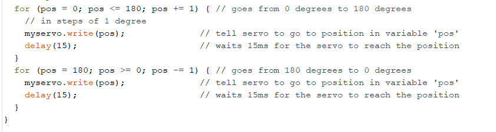

# Paper Puppets

*A lab report by Eva Pilar Esteban Velasco*

## Part A. Actuating DC motors

**Link to a video of your vibration motor**

[Link to Vibration Motor Video](Vibration_Motor_Muted.mp4)

## Part B. Actuating Servo motors

### Part 1. Connect the Servo to your breadboard

**a. Which color wires correspond to power, ground and signal?**

Brown = Ground, Red = Power, Orange = Signal.

### Part 2. Connect the Servo to your Arduino

**a. Which Arduino pin should the signal line of the servo be attached to?**

Pin 9.

**b. What aspects of the Servo code control angle or speed?**

Inside the loop(), the two for() loops control the angle, going from 0 to 180 degrees, and from 180 to 0 degrees, and they control the speed by setting a delay of 15 ms with the line of code 'delay(15);' between each movement.

## Part C. Integrating input and output

**Include a photo/movie of your raw circuit in action.**

[Link to Raw Circuit Video](Raw_Circuit_Muted.mp4)

## Part D. Paper puppet

**a. Make a video of your proto puppet.**

For this and the next question I directly plugged the device to the computer because there were not enough batteries, but the system will also work with a battery.

[Link to Proto Puppet Video](Proto_Puppet_Muted.mp4)

## Part E. Make it your own

**a. Make a video of your final design.**
 
My final design consists of a day progress tracker. It is designed to be placed near a window. It uses a photocell to track the light progress during the day. When you wake up, the puppet's arms will be down indicating it is the start of the day. The arms will slowly go up as the light diminishes when you get to the late afternoon and evening part of the day. At night, when there is no light, the puppet's arms will be up, simulating a muscle stretch and a yawn and indicating in that way that it is time to sleep. The raised arms are celebrating that you completed the day and that it is time to get a good night's sleep. It is a twist on a light detecting system. For the video, I chose to use a lamp as a light and simulate darkness by covering the photocell up because recording a full 24-hour period with the device near the window would have been too long to post on Github. The link to the video can be found below.

[Link to Puppet Video](Puppet_Muted.mp4)
